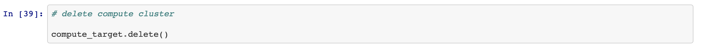

# Optimizing an ML Pipeline in Azure

## Overview
This project is part of the Udacity Azure ML Nanodegree. In this project I built **Azure ML pipeline** using **Python SDK** and a custom **Scikit-learn Logistic Regression** model. Hyperparameters of the model were optimized using Hyperdrive. After this Azure AutoML was used to find optimal model using the same dataset, and the **results of the two methods were compared**. 

See the diagram below showing the main steps followed in the project:


**Step 1:** Setting up the training [script](train.py), to create a Tabular Dataset from imported file, clean and split the data for Scikit-learn logistic regression model. 

**Step 2:** Creating [Jupyter Notebook](udacity-project.ipynb) and configuring HyperDrive to find the best hyperparameters for the logistic regression model. 

**Step 3:** Loading the same dataset, as used with Scikit-learn model, with TabularDatasetFactory and using AutoML to find an optimized model. 

**Step 4:** Comparing the results of the two methods and writing a research summary, this RAEADME.md.

## Summary
The data is related with direct marketing campaigns (phone calls) of a Portuguese banking institution. The classification goal is to predict if the client will subscribe a term deposit (variable y). 

The best performing model with **0.91627 accuracy** was the **AutoML model** which used **VotingEnsemble** algorith. The best **HyperDrive model** using **Scikit-learn logistic regression** had nearly as good accuracy of **0.90895**.

## Scikit-learn Pipeline

Built Scikit-learn pipeline uses [Logistic Regression](https://scikit-learn.org/stable/modules/generated/sklearn.linear_model.LogisticRegression.html) model for classification, while the hyperparameters were tuned using [HyperDrive](https://docs.microsoft.com/en-us/azure/machine-learning/how-to-tune-hyperparameters). The used hyperparameters were C (Inverse of regularization strength) with unform value distribution and max_iter (Maximum number of iterations taken for the solvers to converge) with discrete values for choice. 

**Parameter Sampling**

RandomParameterSampling, where hyperparameter values are randomly selected from the defined search space, was used as a sampler. It is a good choice as it is [more efficient, though less exhaustive compared](https://www.sciencedirect.com/science/article/pii/S1674862X19300047) to Grid grid search to search over the search space.

```
ps = RandomParameterSampling({
    '--max_iter' : choice(20,40,80,100,150,200),
    '--C' : uniform(0.001,10)
}) 
```
**Early Stopping Policy**

This strategy of stopping early based on the validation set performance is called [Early Stopping](https://towardsdatascience.com/early-stopping-a-cool-strategy-to-regularize-neural-networks-bfdeca6d722e). Early stopping policy helps to terminate poorly performing runs and improves computational efficiency. Here [Bandit policy](https://docs.microsoft.com/en-us/azure/machine-learning/how-to-tune-hyperparameters) was used as an early stopping policy, and was configured as follows:
```
policy = BanditPolicy(evaluation_interval=2,slack_factor=0.1,delay_evaluation=1)
```
In this example, the early termination policy is applied at every second interval when metrics are reported, starting at evaluation interval 1. Any run whose best metric is less than (1/(1+0.1) or 91% of the best performing run will be terminated.

## AutoML

[AutoML](https://docs.microsoft.com/en-us/azure/machine-learning/concept-automated-ml) works in a way that it creates a number of pipelines in parallel that tries different algorithms and parameters for you. The service iterates through ML algorithms paired with feature selections, where each iteration produces a model with a training score. The higher the score, the better the model is considered to "fit" your data. It will stop once it hits the exit criteria defined in the experiment.

Here I chose the following confifuration for the AutoML run:
```
automl_config = AutoMLConfig(
    experiment_timeout_minutes=30,
    task='classification',
    primary_metric='accuracy',
    training_data=ds,
    label_column_name='y',
    n_cross_validations=2)
```
Where:

*experiment_timeout_minutes* = Maximum amount of time in hours that all iterations combined can take before the experiment terminates. 

*task* = Defines what kind of problem to solve, here 'classification' was chosen

*primary_metric* = The metric that Automated Machine Learning will optimize for model selection, here 'accuracy' was chosen

*n_cross_validations* = [This parameter sets how many cross validations to perform, based on the same number of folds](https://docs.microsoft.com/en-us/azure/machine-learning/how-to-configure-cross-validation-data-splits) (folds=subsections). [Cross validation is a technique that allows us to produce test set like scoring metrics using the training set. It simulates the effects of “going out of sample” using just our training data, so we can get a sense of how well our model generalizes.](https://towardsdatascience.com/understanding-cross-validation-419dbd47e9bd) Chosen value '2' means, two different trainings, each training using 1/2 of the data, and each validation using 1/2 of the data with a different holdout fold each time. As a result, metrics are calculated with the average of the two validation metrics.

## Pipeline comparison

The two models, AutoML and Hyperdrive, both had quite similar performance in our experiments. Best AutoML run had an accuracy of **0.91627 accuracy**. Whereas, the best **Hyperdrive** run had an accuracy of **0.90895** - being also adequate and nearly as good. The both pipelines make use of the same data cleansing process, however AutoML adds a preprocessing step prior to model training, as [in every automated machine learning experiment data is automatically scaled or normalized to help algorithms perform well](https://docs.microsoft.com/en-us/azure/machine-learning/concept-automated-ml). 

Architectually the two models are quite different. AutoML model uses [Voting Ensemble](https://machinelearningmastery.com/voting-ensembles-with-python/) algorith which works by combining the predictions from multiple models and In the case of classification, the predictions for each label are summed and the label with the majority vote is predicted. HyperDrive model using [Logistic Regression](https://machinelearningmastery.com/logistic-regression-for-machine-learning/) algorithm, uses a much simpler logistic function with a threshold to carry out binary classification. 

Given more time to do more iterations we might have seen greater differences in metrics, as AutoML could result in better performance by going through multiple classifciation models while the HyperDrive option still just uses the Logistic Regression algorithm.

## Future work

For future work it would be interesting to do more exploratory data analysis prior to experimenting, as to find out e.g. imbalances in target classes, which is a quite common issues with classification problems impacting the model's accuracy - accuracy of majority class can be very high, while minority class accuracy can be very poor. Thus only evaluating model's performance by a simple metric like accuracy might be misleading. As a solution for imbalanced data, a performance metric that better deals with imbalanced data could be used, such as **AUC_weighted**. [AUC_weighted calculates the contribution of every class based on the relative no. of samples representing the class, thus being more robust against imbalanced data](https://docs.microsoft.com/en-us/azure/machine-learning/concept-manage-ml-pitfalls) and so giving more accurate results.

With HyperDrive model we could also try other methods for hyperparameter selection after initial search with Ramdom Sampling. Here using Grid Search we can refine and narrow the search to find the best hyperparameters, in order to get the [optimal performance out of the model](https://medium.com/@jorgesleonel/hyperparameters-in-machine-deep-learning-ca69ad10b981). With AutoML, we could in turn increase the number of iterations allowing the runs to go through more models, and so find the best possible model for a chosen problem.

## Proof of cluster clean up 

